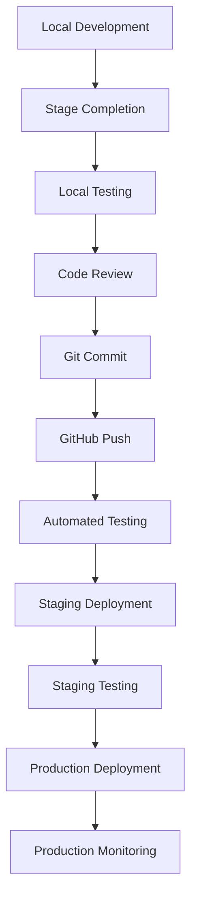

# Deployment Strategy - SportsCoach V3

## 🎯 Deployment Philosophy

Our deployment strategy follows **Infrastructure as Code** principles with emphasis on **zero-downtime deployments** and **automated quality gates**.

## 🏗️ Environment Architecture

### Development Environment

**Purpose**: Local development and testing
**Infrastructure**: Local machine + Firebase emulators
**Access**: Developer machines only

```bash
# Local development setup
npm run dev              # Next.js development server
npm run firebase:emulators  # Firebase local emulators
npm run test:watch       # Continuous testing
```

### Staging Environment

**Purpose**: Pre-production testing and client reviews
**Infrastructure**: Vercel Preview + Firebase staging project
**Access**: Development team + stakeholders
**URL**: Auto-generated Vercel preview URLs

### Production Environment

**Purpose**: Live application serving real users
**Infrastructure**: Vercel production + Firebase production project
**Access**: End users + monitoring systems
**URL**: Custom domain with SSL

## 🚀 Deployment Pipeline

### Stage-Based Deployment Process



### Automated Quality Gates

#### Gate 1: Pre-commit Validation

```bash
# Runs automatically via Husky
npm run lint           # ESLint validation
npm run type-check     # TypeScript compilation
npm run test:unit      # Unit test execution
npm run format         # Code formatting
```

#### Gate 2: Pre-deployment Testing

```bash
# Runs on GitHub Actions
npm run build          # Production build
npm run test:coverage  # Test coverage validation
npm run test:e2e       # End-to-end testing
npm run audit          # Security audit
```

#### Gate 3: Post-deployment Verification

```bash
# Automated health checks
curl -f $DEPLOYMENT_URL/api/health
npm run test:smoke     # Smoke test execution
npm run lighthouse     # Performance audit
```

## 📋 Deployment Checklist

### Pre-Stage Deployment

- [ ] All stage requirements completed
- [ ] Unit tests pass with >80% coverage
- [ ] Integration tests pass
- [ ] Browser tests pass on all target devices
- [ ] Performance tests meet benchmarks
- [ ] Security audit shows no high-severity issues
- [ ] Code review completed and approved

### Stage Deployment Process

- [ ] Create feature branch for stage
- [ ] Implement stage requirements
- [ ] Write and run comprehensive tests
- [ ] Update documentation
- [ ] Create pull request with detailed description
- [ ] Review and merge to main branch
- [ ] Tag release with stage version
- [ ] Deploy to staging environment
- [ ] Perform staging validation tests
- [ ] Deploy to production environment
- [ ] Monitor production deployment

### Post-Deployment Verification

- [ ] Health check endpoints responding
- [ ] Error rates within normal parameters
- [ ] Performance metrics meet targets
- [ ] User authentication working
- [ ] Database connections stable
- [ ] Monitoring and alerting active

## 🔧 Infrastructure Configuration

### Vercel Configuration (vercel.json)

```json
{
  "version": 2,
  "builds": [
    {
      "src": "package.json",
      "use": "@vercel/next"
    }
  ],
  "env": {
    "NEXT_PUBLIC_FIREBASE_API_KEY": "@firebase-api-key",
    "NEXT_PUBLIC_FIREBASE_AUTH_DOMAIN": "@firebase-auth-domain",
    "NEXT_PUBLIC_FIREBASE_PROJECT_ID": "@firebase-project-id",
    "FIREBASE_SERVICE_ACCOUNT_KEY": "@firebase-service-account"
  },
  "regions": ["iad1"],
  "functions": {
    "pages/api/**/*.js": {
      "maxDuration": 30
    }
  },
  "headers": [
    {
      "source": "/(.*)",
      "headers": [
        {
          "key": "X-Frame-Options",
          "value": "DENY"
        },
        {
          "key": "X-Content-Type-Options",
          "value": "nosniff"
        },
        {
          "key": "X-XSS-Protection",
          "value": "1; mode=block"
        },
        {
          "key": "Strict-Transport-Security",
          "value": "max-age=31536000; includeSubDomains"
        }
      ]
    }
  ]
}
```

### GitHub Actions Workflow (.github/workflows/deploy.yml)

```yaml
name: Deploy SportsCoach V3

on:
  push:
    branches: [main]
  pull_request:
    branches: [main]

env:
  NODE_VERSION: '18'

jobs:
  test:
    runs-on: ubuntu-latest

    steps:
      - name: Checkout code
        uses: actions/checkout@v4

      - name: Setup Node.js
        uses: actions/setup-node@v4
        with:
          node-version: ${{ env.NODE_VERSION }}
          cache: 'npm'

      - name: Install dependencies
        run: npm ci

      - name: Run linting
        run: npm run lint

      - name: Type checking
        run: npm run type-check

      - name: Run unit tests
        run: npm run test:coverage

      - name: Build application
        run: npm run build

      - name: Run E2E tests
        run: npm run test:e2e

  deploy-staging:
    needs: test
    runs-on: ubuntu-latest
    if: github.event_name == 'pull_request'

    steps:
      - name: Deploy to Vercel (Preview)
        uses: amondnet/vercel-action@v25
        with:
          vercel-token: ${{ secrets.VERCEL_TOKEN }}
          vercel-org-id: ${{ secrets.VERCEL_ORG_ID }}
          vercel-project-id: ${{ secrets.VERCEL_PROJECT_ID }}

  deploy-production:
    needs: test
    runs-on: ubuntu-latest
    if: github.ref == 'refs/heads/main'

    steps:
      - name: Deploy to Vercel (Production)
        uses: amondnet/vercel-action@v25
        with:
          vercel-token: ${{ secrets.VERCEL_TOKEN }}
          vercel-org-id: ${{ secrets.VERCEL_ORG_ID }}
          vercel-project-id: ${{ secrets.VERCEL_PROJECT_ID }}
          vercel-args: '--prod'

      - name: Run smoke tests
        run: npm run test:smoke
        env:
          TEST_URL: ${{ steps.deploy.outputs.preview-url }}

      - name: Notify deployment success
        uses: 8398a7/action-slack@v3
        with:
          status: success
          text: 'SportsCoach V3 deployed successfully to production!'
        env:
          SLACK_WEBHOOK_URL: ${{ secrets.SLACK_WEBHOOK }}
```

## 🔐 Environment Variables Management

### Development Environment (.env.local)

```bash
# Firebase Configuration
NEXT_PUBLIC_FIREBASE_API_KEY=your-development-api-key
NEXT_PUBLIC_FIREBASE_AUTH_DOMAIN=your-dev-project.firebaseapp.com
NEXT_PUBLIC_FIREBASE_PROJECT_ID=your-dev-project
NEXT_PUBLIC_FIREBASE_STORAGE_BUCKET=your-dev-project.appspot.com
NEXT_PUBLIC_FIREBASE_MESSAGING_SENDER_ID=123456789
NEXT_PUBLIC_FIREBASE_APP_ID=1:123456789:web:abcdef

# Firebase Admin (for API routes)
FIREBASE_SERVICE_ACCOUNT_KEY={"type":"service_account",...}

# Development flags
NODE_ENV=development
NEXT_PUBLIC_ENV=development
```

### Production Environment (Vercel Dashboard)

- All environment variables configured through Vercel dashboard
- Production Firebase project credentials
- Third-party API keys for production services
- Monitoring and analytics tokens

### Security Best Practices

- Use Vercel's environment variable encryption
- Rotate API keys regularly
- Implement least-privilege access principles
- Monitor environment variable access logs

## 📊 Monitoring & Observability

### Health Check Endpoints

```typescript
// pages/api/health.ts
export default function handler(req: NextApiRequest, res: NextApiResponse) {
  const healthCheck = {
    timestamp: new Date().toISOString(),
    status: 'ok',
    version: process.env.npm_package_version,
    environment: process.env.NODE_ENV,
    checks: {
      database: 'ok',
      auth: 'ok',
      storage: 'ok',
    },
  };

  res.status(200).json(healthCheck);
}
```

### Error Tracking with Sentry

```typescript
// next.config.js
const { withSentryConfig } = require('@sentry/nextjs');

const moduleExports = {
  // Next.js configuration
};

const sentryWebpackPluginOptions = {
  silent: true,
  org: 'sportscoach',
  project: 'sportscoach-v3',
};

module.exports = withSentryConfig(moduleExports, sentryWebpackPluginOptions);
```

### Performance Monitoring

```typescript
// lib/analytics.ts
export const trackPerformance = (metricName: string, value: number) => {
  if (typeof window !== 'undefined' && window.gtag) {
    window.gtag('event', 'timing_complete', {
      name: metricName,
      value: Math.round(value),
    });
  }
};

// Track Core Web Vitals
export const reportWebVitals = (metric: any) => {
  trackPerformance(metric.name, metric.value);
};
```

## 🚨 Rollback Procedures

### Automatic Rollback Triggers

- Error rate > 5% for 5 minutes
- Response time > 5 seconds for 3 minutes
- Health check failures for 2 minutes
- Critical security alerts

### Manual Rollback Process

```bash
# 1. Identify last stable deployment
vercel ls --limit 10

# 2. Promote previous deployment
vercel promote <previous-deployment-url> --scope=production

# 3. Verify rollback success
curl -f https://sportscoach.app/api/health

# 4. Notify team of rollback
slack-notify "Emergency rollback completed for SportsCoach V3"
```

### Post-Rollback Actions

1. Investigate root cause of deployment failure
2. Create hotfix branch for critical issues
3. Update monitoring and alerting if needed
4. Document incident and lessons learned
5. Plan forward fix deployment

## 📈 Performance Optimization

### Build Optimization

```javascript
// next.config.js
const nextConfig = {
  experimental: {
    optimizePackageImports: ['@radix-ui/react-icons'],
  },
  images: {
    formats: ['image/webp', 'image/avif'],
    deviceSizes: [640, 750, 828, 1080, 1200, 1920, 2048, 3840],
  },
  compiler: {
    removeConsole: process.env.NODE_ENV === 'production',
  },
  output: 'standalone',
  poweredByHeader: false,
  compress: true,
};
```

### CDN and Caching Strategy

```typescript
// pages/api/sports/[id].ts
export default function handler(req: NextApiRequest, res: NextApiResponse) {
  // Set cache headers for static content
  res.setHeader(
    'Cache-Control',
    'public, max-age=3600, stale-while-revalidate=86400'
  );

  // Return sport data
  res.json(sportData);
}
```

## 🔄 Database Deployment

### Firebase Security Rules Deployment

```bash
# Deploy Firestore rules
firebase deploy --only firestore:rules

# Deploy Storage rules
firebase deploy --only storage

# Deploy Cloud Functions (if used)
firebase deploy --only functions
```

### Database Migration Strategy

```typescript
// lib/migrations.ts
export const runMigrations = async () => {
  const migrations = [
    migration_001_add_user_profiles,
    migration_002_update_quiz_schema,
    migration_003_add_progress_tracking,
  ];

  for (const migration of migrations) {
    await migration.run();
  }
};
```

## 📋 Stage-Specific Deployment Notes

### Stage 1: Foundation

- Set up Vercel project and domains
- Configure basic CI/CD pipeline
- Establish monitoring and error tracking
- Deploy initial project structure

### Stage 2: Authentication

- Configure Firebase Authentication
- Set up user management in production
- Test authentication flows in staging
- Deploy with user registration enabled

### Stage 3: Database

- Deploy Firestore security rules
- Set up production database collections
- Configure backup and restore procedures
- Test data migration procedures

### Stage 4-8: Feature Deployments

- Each stage includes specific configuration
- Progressive feature rollout using feature flags
- Performance monitoring for new features
- User acceptance testing in staging

## 🎯 Success Metrics

### Deployment Success Criteria

- ✅ Zero-downtime deployment achieved
- ✅ All health checks pass post-deployment
- ✅ Performance metrics within target ranges
- ✅ Error rates remain below 1%
- ✅ User authentication working correctly
- ✅ All critical user flows functional

### Production Readiness Checklist

- [ ] Load testing completed successfully
- [ ] Security audit passed
- [ ] Backup and disaster recovery tested
- [ ] Monitoring and alerting configured
- [ ] Documentation complete and accessible
- [ ] Team trained on production procedures

---

**This deployment strategy ensures reliable, secure, and performant deployments with comprehensive monitoring and quick rollback capabilities. Each stage deployment follows the same rigorous process to maintain consistency and quality.**
