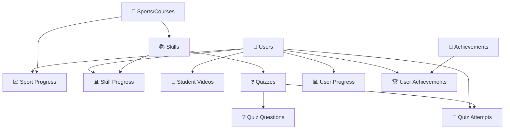

# 🗺️ Firebase Field Mapping Matrix

## 📋 **Overview**
This document provides a comprehensive mapping between TypeScript interfaces and Firebase database collections, ensuring data integrity and consistency across the SportsCoach V3 application.

## 🏗️ **Data Architecture Overview**



## 📊 **Collection Mapping Matrix**

### **1. Users Collection (`/users/{userId}`)**
| TypeScript Field | Database Field | Type | Required | Notes |
|------------------|----------------|------|----------|-------|
| `id` | Document ID | `string` | ✅ | Auto-generated |
| `email` | `email` | `string` | ✅ | Unique identifier |
| `displayName` | `displayName` | `string` | ✅ | User's display name |
| `role` | `role` | `'student' \| 'admin'` | ✅ | User role |
| `profileImage` | `profileImage` | `string` | ❌ | Storage URL |
| `emailVerified` | `emailVerified` | `boolean` | ✅ | Auth status |
| `preferences` | `preferences` | `UserPreferences` | ✅ | User settings |
| `profile` | `profile` | `UserProfile` | ❌ | Extended profile |
| `createdAt` | `createdAt` | `Timestamp` | ✅ | Created timestamp |
| `updatedAt` | `updatedAt` | `Timestamp` | ✅ | Updated timestamp |
| `lastLoginAt` | `lastLoginAt` | `Timestamp` | ❌ | Last login |

### **2. Sports Collection (`/sports/{sportId}`) - COURSES**
| TypeScript Field | Database Field | Type | Required | Notes |
|------------------|----------------|------|----------|-------|
| `id` | Document ID | `string` | ✅ | Auto-generated |
| `name` | `name` | `string` | ✅ | Course/sport name |
| `description` | `description` | `string` | ✅ | Course description |
| `icon` | `icon` | `string` | ✅ | Icon identifier |
| `color` | `color` | `string` | ✅ | Theme color |
| `category` | `category` | `string` | ✅ | Course category |
| `difficulty` | `difficulty` | `DifficultyLevel` | ✅ | beginner/intermediate/advanced |
| `estimatedTimeToComplete` | `estimatedTimeToComplete` | `number` | ✅ | Hours |
| `skillsCount` | `skillsCount` | `number` | ✅ | Number of skills |
| `imageUrl` | `imageUrl` | `string` | ❌ | Course image |
| `tags` | `tags` | `string[]` | ✅ | Search tags |
| `prerequisites` | `prerequisites` | `string[]` | ❌ | Required sport IDs |
| `isActive` | `isActive` | `boolean` | ✅ | Visibility status |
| `isFeatured` | `isFeatured` | `boolean` | ✅ | Featured flag |
| `order` | `order` | `number` | ✅ | Display order |
| `metadata` | `metadata` | `SportMetadata` | ✅ | Statistics |
| `createdAt` | `createdAt` | `Timestamp` | ✅ | Created timestamp |
| `updatedAt` | `updatedAt` | `Timestamp` | ✅ | Updated timestamp |
| `createdBy` | `createdBy` | `string` | ✅ | Creator user ID |

### **3. Skills Collection (`/skills/{skillId}`)**
| TypeScript Field | Database Field | Type | Required | Notes |
|------------------|----------------|------|----------|-------|
| `id` | Document ID | `string` | ✅ | Auto-generated |
| `sportId` | `sportId` | `string` | ✅ | Parent sport ID |
| `name` | `name` | `string` | ✅ | Skill name |
| `description` | `description` | `string` | ✅ | Skill description |
| `difficulty` | `difficulty` | `DifficultyLevel` | ✅ | beginner/intermediate/advanced |
| `estimatedTimeToComplete` | `estimatedTimeToComplete` | `number` | ✅ | Minutes |
| `content` | `content` | `string` | ❌ | Rich HTML content |
| `externalResources` | `externalResources` | `ExternalResource[]` | ✅ | External links |
| `media` | `media` | `SkillMedia` | ❌ | Videos/images |
| `prerequisites` | `prerequisites` | `string[]` | ✅ | Required skill IDs |
| `learningObjectives` | `learningObjectives` | `string[]` | ✅ | Learning goals |
| `tags` | `tags` | `string[]` | ✅ | Search tags |
| `hasVideo` | `hasVideo` | `boolean` | ✅ | Video availability |
| `hasQuiz` | `hasQuiz` | `boolean` | ✅ | Quiz availability |
| `isActive` | `isActive` | `boolean` | ✅ | Visibility status |
| `order` | `order` | `number` | ✅ | Display order |
| `metadata` | `metadata` | `SkillMetadata` | ✅ | Statistics |
| `createdAt` | `createdAt` | `Timestamp` | ✅ | Created timestamp |
| `updatedAt` | `updatedAt` | `Timestamp` | ✅ | Updated timestamp |
| `createdBy` | `createdBy` | `string` | ✅ | Creator user ID |

### **4. Quizzes Collection (`/quizzes/{quizId}`)**
| TypeScript Field | Database Field | Type | Required | Notes |
|------------------|----------------|------|----------|-------|
| `id` | Document ID | `string` | ✅ | Auto-generated |
| `skillId` | `skillId` | `string` | ✅ | Parent skill ID |
| `sportId` | `sportId` | `string` | ✅ | Parent sport ID |
| `title` | `title` | `string` | ✅ | Quiz title |
| `description` | `description` | `string` | ✅ | Quiz description |
| `difficulty` | `difficulty` | `DifficultyLevel` | ✅ | beginner/intermediate/advanced |
| `timeLimit` | `timeLimit` | `number` | ✅ | Minutes |
| `passingScore` | `passingScore` | `number` | ✅ | Percentage |
| `maxAttempts` | `maxAttempts` | `number` | ✅ | Maximum attempts |
| `allowReview` | `allowReview` | `boolean` | ✅ | Review allowed |
| `shuffleQuestions` | `shuffleQuestions` | `boolean` | ✅ | Randomize order |
| `showAnswersAfterCompletion` | `showAnswersAfterCompletion` | `boolean` | ✅ | Show correct answers |
| `isActive` | `isActive` | `boolean` | ✅ | Visibility status |
| `metadata` | `metadata` | `QuizMetadata` | ✅ | Statistics |
| `createdAt` | `createdAt` | `Timestamp` | ✅ | Created timestamp |
| `updatedAt` | `updatedAt` | `Timestamp` | ✅ | Updated timestamp |
| `createdBy` | `createdBy` | `string` | ✅ | Creator user ID |

### **5. Quiz Questions Collection (`/quiz_questions/{questionId}`)**
| TypeScript Field | Database Field | Type | Required | Notes |
|------------------|----------------|------|----------|-------|
| `id` | Document ID | `string` | ✅ | Auto-generated |
| `quizId` | `quizId` | `string` | ✅ | Parent quiz ID |
| `type` | `type` | `QuestionType` | ✅ | multiple_choice/true_false/etc |
| `question` | `question` | `string` | ✅ | Question text |
| `options` | `options` | `string[]` | ❌ | For MCQ questions |
| `correctAnswer` | `correctAnswer` | `string \| number` | ✅ | Correct answer |
| `explanation` | `explanation` | `string` | ✅ | Answer explanation |
| `points` | `points` | `number` | ✅ | Question weight |
| `media` | `media` | `QuestionMedia` | ❌ | Images/videos |
| `order` | `order` | `number` | ✅ | Display order |
| `difficulty` | `difficulty` | `DifficultyLevel` | ✅ | Question difficulty |
| `tags` | `tags` | `string[]` | ✅ | Search tags |
| `createdAt` | `createdAt` | `Timestamp` | ✅ | Created timestamp |
| `updatedAt` | `updatedAt` | `Timestamp` | ✅ | Updated timestamp |

### **6. Quiz Attempts Collection (`/quiz_attempts/{attemptId}`)**
| TypeScript Field | Database Field | Type | Required | Notes |
|------------------|----------------|------|----------|-------|
| `id` | Document ID | `string` | ✅ | Auto-generated |
| `userId` | `userId` | `string` | ✅ | User ID |
| `quizId` | `quizId` | `string` | ✅ | Quiz ID |
| `skillId` | `skillId` | `string` | ✅ | Skill ID |
| `sportId` | `sportId` | `string` | ✅ | Sport ID |
| `answers` | `answers` | `QuizAnswer[]` | ✅ | User answers |
| `score` | `score` | `number` | ✅ | Points earned |
| `maxScore` | `maxScore` | `number` | ✅ | Total points |
| `percentage` | `percentage` | `number` | ✅ | Score percentage |
| `passed` | `passed` | `boolean` | ✅ | Pass/fail status |
| `timeSpent` | `timeSpent` | `number` | ✅ | Minutes spent |
| `attemptNumber` | `attemptNumber` | `number` | ✅ | Attempt count |
| `isCompleted` | `isCompleted` | `boolean` | ✅ | Completion status |
| `startedAt` | `startedAt` | `Timestamp` | ✅ | Start time |
| `completedAt` | `completedAt` | `Timestamp` | ❌ | Completion time |
| `submittedAt` | `submittedAt` | `Timestamp` | ❌ | Submission time |

### **7. Sport Progress Collection (`/sport_progress/{progressId}`)**
| TypeScript Field | Database Field | Type | Required | Notes |
|------------------|----------------|------|----------|-------|
| `id` | Document ID | `string` | ✅ | Auto-generated |
| `userId` | `userId` | `string` | ✅ | User ID |
| `sportId` | `sportId` | `string` | ✅ | Sport ID |
| `status` | `status` | `ProgressStatus` | ✅ | not_started/in_progress/completed |
| `completedSkills` | `completedSkills` | `string[]` | ✅ | Completed skill IDs |
| `totalSkills` | `totalSkills` | `number` | ✅ | Total skills in sport |
| `progressPercentage` | `progressPercentage` | `number` | ✅ | Completion percentage |
| `timeSpent` | `timeSpent` | `number` | ✅ | Minutes spent |
| `currentSkillId` | `currentSkillId` | `string` | ❌ | Active skill |
| `streak` | `streak` | `StreakInfo` | ✅ | Activity streak |
| `rating` | `rating` | `number` | ❌ | User rating |
| `review` | `review` | `string` | ❌ | User review |
| `startedAt` | `startedAt` | `Timestamp` | ✅ | Start time |
| `completedAt` | `completedAt` | `Timestamp` | ❌ | Completion time |
| `lastAccessedAt` | `lastAccessedAt` | `Timestamp` | ✅ | Last access |

### **8. Student Videos Collection (`/student_videos/{videoId}`)**
| TypeScript Field | Database Field | Type | Required | Notes |
|------------------|----------------|------|----------|-------|
| `id` | Document ID | `string` | ✅ | Auto-generated |
| `studentId` | `studentId` | `string` | ✅ | Student user ID |
| `studentName` | `studentName` | `string` | ✅ | Student name |
| `studentEmail` | `studentEmail` | `string` | ✅ | Student email |
| `videoUrl` | `videoUrl` | `string` | ✅ | Storage URL |
| `storagePath` | `storagePath` | `string` | ✅ | Firebase storage path |
| `fileName` | `fileName` | `string` | ✅ | Original filename |
| `fileSize` | `fileSize` | `number` | ✅ | File size in bytes |
| `uploadedAt` | `uploadedAt` | `Timestamp` | ✅ | Upload time |
| `status` | `status` | `string` | ✅ | pending/reviewed/rejected |
| `adminFeedback` | `adminFeedback` | `string` | ❌ | Coach feedback |
| `reviewedAt` | `reviewedAt` | `Timestamp` | ❌ | Review time |
| `reviewedBy` | `reviewedBy` | `string` | ❌ | Reviewer ID |

## 🔍 **Validation Rules**

### **Required Fields Validation**
Each collection has mandatory fields that must be present:

**Users Collection:**
```typescript
const userRequiredFields = ['email', 'displayName', 'role', 'emailVerified', 'preferences'];
```

**Sports Collection:**
```typescript
const sportRequiredFields = ['name', 'description', 'difficulty', 'category', 'isActive'];
```

**Skills Collection:**
```typescript
const skillRequiredFields = ['name', 'description', 'sportId', 'difficulty'];
```

**Quizzes Collection:**
```typescript
const quizRequiredFields = ['title', 'questions', 'settings', 'difficulty', 'isActive', 'createdBy', 'sportId', 'skillId'];
```

### **Data Type Validation**
Common validation patterns:

```typescript
// Difficulty levels
type DifficultyLevel = 'beginner' | 'intermediate' | 'advanced';

// Progress status
type ProgressStatus = 'not_started' | 'in_progress' | 'completed';

// Question types
type QuestionType = 'multiple_choice' | 'true_false' | 'descriptive' | 'image_choice';

// User roles
type UserRole = 'student' | 'admin';
```

## 🚨 **Known Potential Issues**

### **Field Name Inconsistencies**
- [ ] Check for camelCase vs snake_case inconsistencies
- [ ] Validate nested object field names
- [ ] Ensure array field structures match interfaces

### **Optional vs Required Mismatches**
- [ ] Fields marked optional in TypeScript but required in validation
- [ ] Database fields missing from TypeScript interfaces
- [ ] Unused fields in database collections

### **Data Type Mismatches**
- [ ] Number vs string inconsistencies
- [ ] Date vs Timestamp handling
- [ ] Array vs object structure differences

## 📈 **Usage Patterns**

### **Common Query Patterns**
1. **Get all active sports**: `where('isActive', '==', true)`
2. **Get skills by sport**: `where('sportId', '==', sportId)`
3. **Get user progress**: `where('userId', '==', userId)`
4. **Get quiz attempts**: `where('userId', '==', userId).where('quizId', '==', quizId)`

### **Security Rule Alignment**
Each collection's access patterns must align with security rules:

```javascript
// Sports - Public read access
allow read: if true;

// Users - Owner or admin access
allow read: if isOwnerOrAdmin(userId);

// Quiz attempts - User's own attempts
allow read: if isOwnerOrAdmin(resource.data.userId);
```

## ✅ **Audit Checklist**
- [ ] All TypeScript interfaces have corresponding database fields
- [ ] All required fields are properly validated
- [ ] Data types match between interfaces and database
- [ ] Optional fields are consistently handled
- [ ] Security rules align with data access patterns
- [ ] Query patterns follow established conventions
- [ ] Error handling is consistent across collections

---

**Next Steps**: Use this matrix to validate all database operations and ensure consistency across the application.